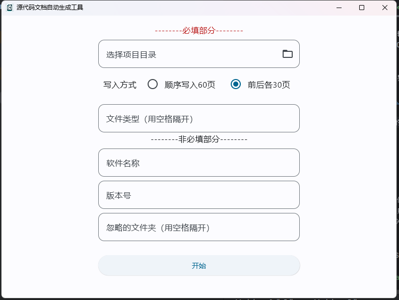
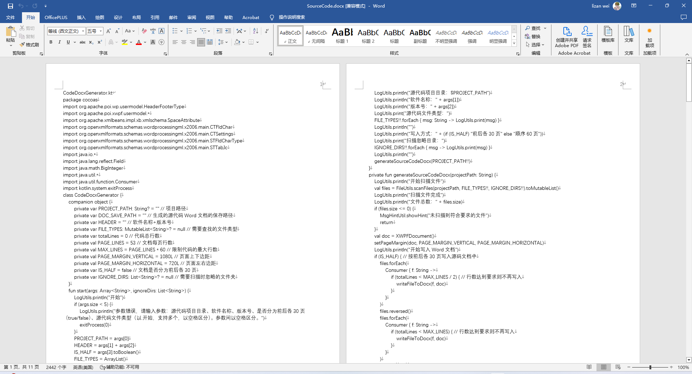

# SourceCodeDocxGeneratorCompose
SourceCodeDocxGeneratorCompose 是一个自动生成软著申请所需的项目源代码Word文档的工具，使用它可以很方便地生成60页的源代码文档，而不用手动撸。  

SourceCodeDocxGeneratorCompose 基于 [SourceCodeDocxGenerator](https://github.com/CharlieJiang/SourceCodeDocxGenerator) 并使用 Compose Desktop 重新实现了 UI

SourceCodeDocxGenerator基于Apache POI实现，详情请参考代码。

## 更新
SourceCodeDocxGenerator目前可在 Release 中下载直接运行。
* **图形界面使用截图**   
  
* **参数说明**   
  **忽略目录**参数用于填写扫描时需要忽略的源代码目录，只需要输入目录名而无需输入目录的相对或绝对路径，多个目录间以空格分割，如"build debug release"。  
  其它参数请参考下方说明。

## 生成的源代码Word文档示例

## 注意
1. 目前支持生成多种文件类型的源代码文档，具体使用方法见下方。
2. 此项目是为了Android软件申请软著开发，所以在目录过滤时未考虑Java项目以及其他语言项目，可能会存在将项目自动生成的代码写进文档中的情况，欢迎提交 pr。
3. 为了保证源代码的完整性，最后一个准备写入Word的源代码文件的内容会被全部写入Word中，由此也会导致最终生成的源代码Word文档的页数可能会超过60页，这时就需要手动调整文档页数。
